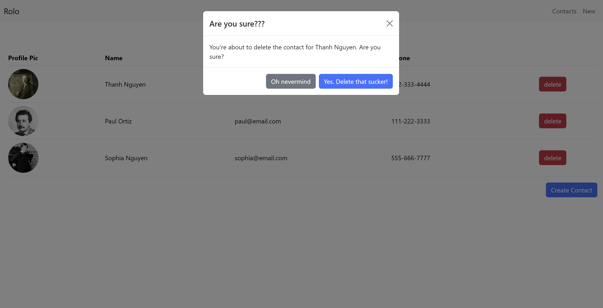

## Contact List

This project has been created by a student at Parsity, an online software engineering course. The work in this repository is wholly of the student based on a sample starter project that can be accessed by looking at the repository that this project forks.

If you have any questions about this project or the program in general, visit [parsity.io](https://parsity.io/) or email hello@parsity.io.

# What is it?

A throwback to classic Rolodex. This app stores your contacts with the ability to add, modify, and delete them.

## Features

- View List of Contacts
  
- View contact card
  
- Switch between contact cards
- Create contact card
  
- Edit/Modify contact
  
- Delete contact
  

## Files/Folder overview

- /app - app entry point
- /app/layout.js - Contains parent component that wraps all other components
- app/components - contains all created custom components, css.module, and hooks
- app/contacts/page.js - project "index" page
  - /[id]/page.js - View individual contact
  - /create/page.js - page to create a new contact
- app/context - contains the custom useContext hook

## Technology used

- JS
- react
- bootstrap
- proptypes
